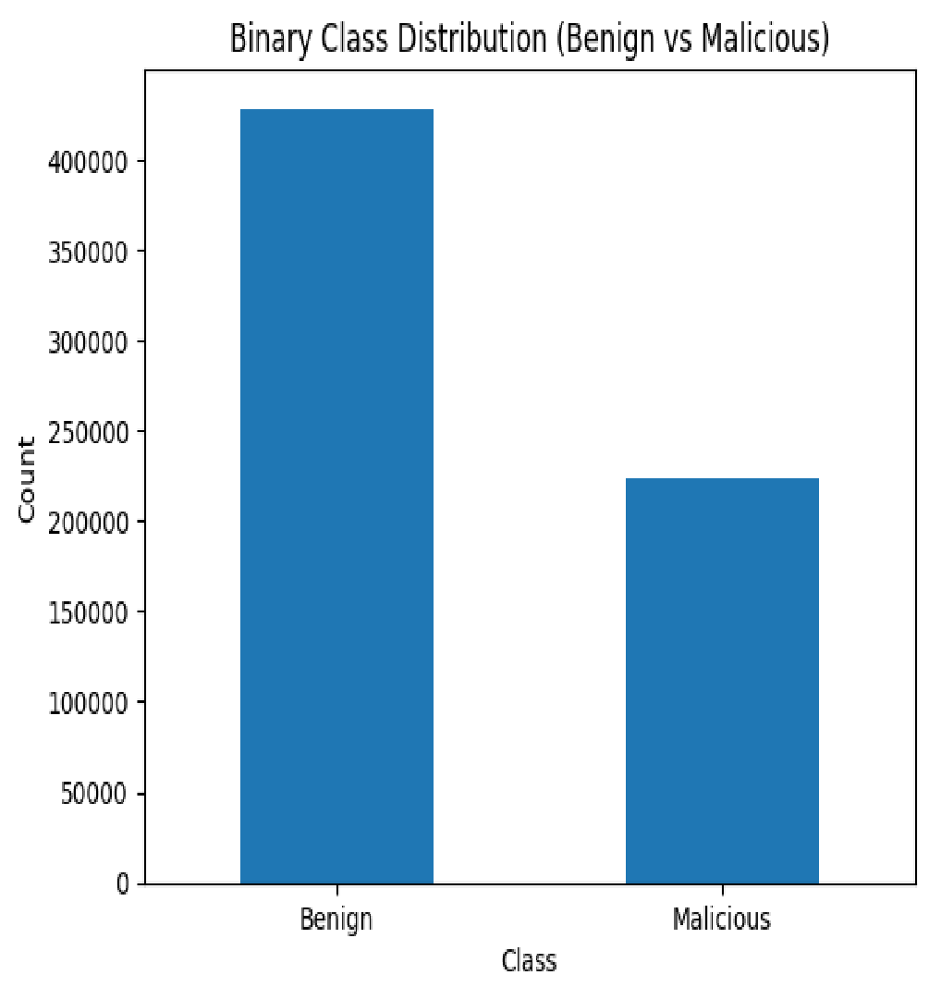
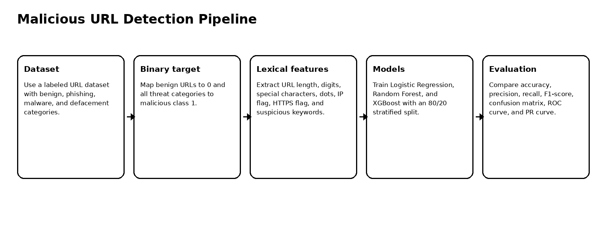
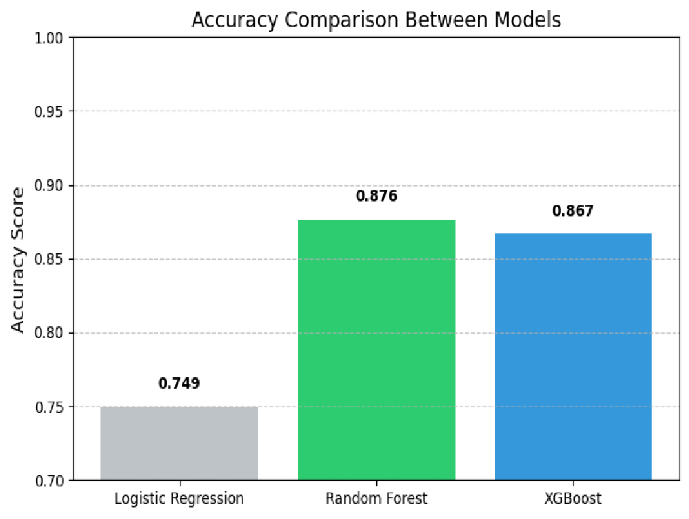
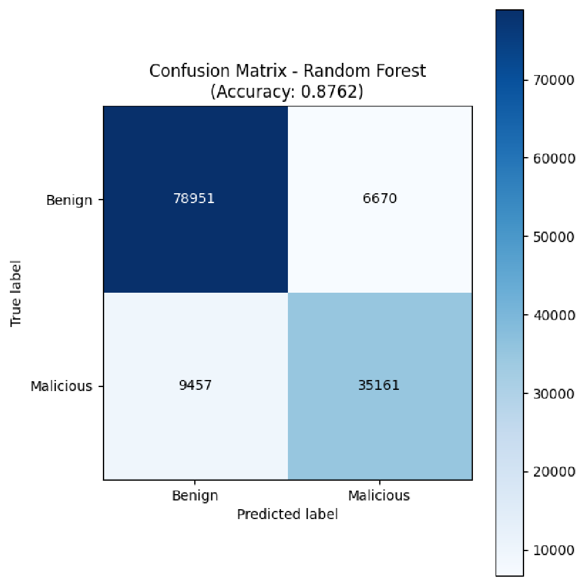
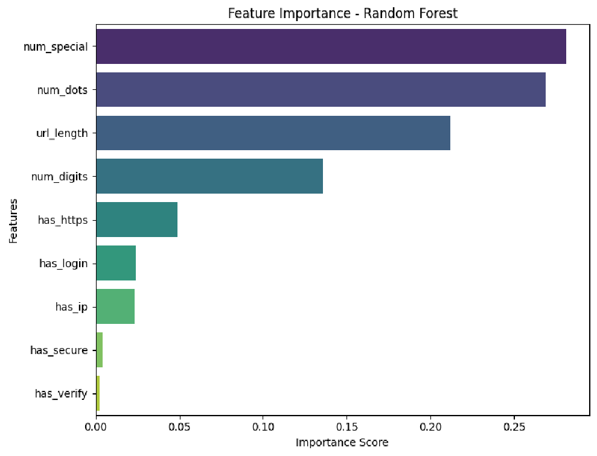
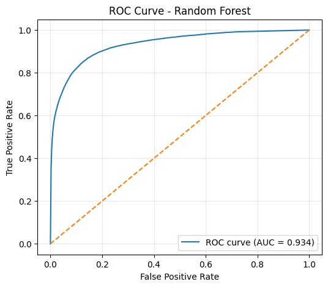
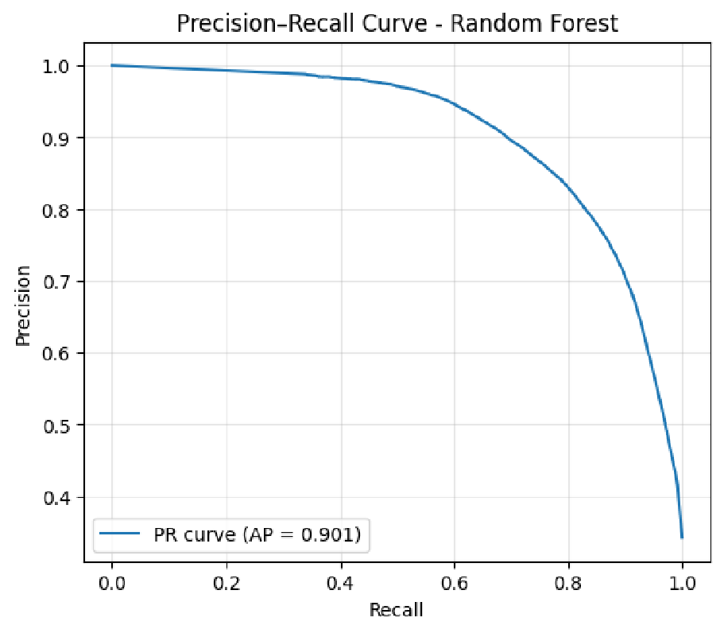

# AI-Based Detection of Spam and Malicious URLs

Machine learning pipeline for classifying URLs as benign or malicious using lexical feature engineering, Random Forest, XGBoost, and Logistic Regression.

## Overview

Malicious URLs are widely used in phishing, malware delivery, defacement campaigns, spam, and online fraud. This project builds a lightweight machine learning system that classifies URLs without visiting the target web page. Instead, it extracts structural and lexical patterns directly from the URL string.

The project compares three models:

- Logistic Regression
- Random Forest
- XGBoost

The best model was **Random Forest**, achieving **0.876 accuracy**, **0.840 precision**, **0.788 recall**, and **0.813 F1-score** on the test set.

## Why URL-Based Detection Matters

URL-based detection is fast and safe because it does not require opening the website. This is useful for email gateways, browser extensions, SOC triage tools, and phishing defense systems where suspicious links need to be screened quickly.

## Dataset

| Item | Value |
|---|---:|
| Dataset size | 651,191 URLs |
| Original labels | benign, phishing, malware, defacement |
| Modeling target | Binary classification |
| Benign class | 0 |
| Malicious class | 1 |
| Train/test split | 80% / 20% stratified |
| Feature type | Lexical URL features |

The original multi-class labels were converted into a binary cybersecurity detection task: benign URLs remain class `0`, while phishing, malware, and defacement URLs are grouped as class `1`.

## Class Distribution



## Detection Pipeline



## Feature Engineering

The model uses lightweight lexical features extracted directly from each URL:

| Feature | Meaning | Security relevance |
|---|---|---|
| `url_length` | Total number of characters | Long URLs may hide suspicious domains or payloads |
| `num_digits` | Count of numeric characters | Random numeric tokens and IP-like patterns can indicate automation |
| `num_special` | Count of non-alphanumeric characters | Obfuscation often uses symbols such as `@`, `-`, `%`, `?`, and `/` |
| `num_dots` | Number of dots | Many subdomains can be used to mimic legitimate services |
| `has_ip` | Raw IP address flag | Legitimate sites rarely expose raw IP addresses to users |
| `has_https` | HTTPS protocol flag | HTTPS is not sufficient because phishing sites can also use SSL |
| `has_login` | Login keyword flag | Common social-engineering trigger |
| `has_verify` | Verify keyword flag | Common urgency/trust trigger |
| `has_secure` | Secure keyword flag | Common phishing lure keyword |

## Model Results

| Model | Accuracy | Precision | Recall | F1-score |
|---|---:|---:|---:|---:|
| Logistic Regression | 0.749 | 0.775 | 0.378 | 0.508 |
| Random Forest | 0.876 | 0.840 | 0.788 | 0.813 |
| XGBoost | 0.866 | 0.835 | 0.760 | 0.796 |

## Accuracy Comparison



The results show a clear performance gap between the linear baseline and the tree-based ensemble methods. Logistic Regression achieved reasonable precision but low recall, while Random Forest and XGBoost captured non-linear URL patterns more effectively.

## Confusion Matrix



Random Forest correctly identified:

| Outcome | Count |
|---|---:|
| True negatives | 78,951 |
| False positives | 6,670 |
| False negatives | 9,457 |
| True positives | 35,161 |

For cybersecurity, recall is especially important because false negatives represent malicious URLs incorrectly classified as safe.

## Feature Importance



The most influential features were `num_special`, `num_dots`, `url_length`, and `num_digits`. This supports the intuition that malicious URLs often rely on long strings, many special characters, and structural obfuscation.

## ROC and Precision-Recall Analysis

| ROC curve | Precision-Recall curve |
|---|---|
|  |  |

The Random Forest model achieved:

| Metric | Value |
|---|---:|
| ROC AUC | 0.934 |
| Average Precision | 0.901 |

## Key Findings

1. Lexical URL features can support fast malicious URL detection without opening web pages.
2. Tree-based ensemble models significantly outperform a linear Logistic Regression baseline.
3. Random Forest achieved the best overall balance of accuracy, precision, recall, and F1-score.
4. XGBoost performed competitively but trailed Random Forest on the reported test metrics.
5. Special-character count, dot count, URL length, and digit count were the most important features.
6. The system should be used as a decision-support layer rather than a sole blocking authority.

## Ethical and Security Considerations

This project is defensive and intended for spam, phishing, and malicious URL detection. A real deployment should consider:

- URL logs may contain sensitive query parameters or tokens.
- False positives can block legitimate websites and harm users or organizations.
- Attackers may attempt adversarial URL manipulation to evade detection.
- Models should be retrained periodically to handle concept drift and new attack patterns.
- Human review or secondary verification is recommended for high-impact decisions.

## Repository Structure

```text
.
├── malicious_url_detection_ml.ipynb
├── src/
│   ├── features.py
│   ├── train.py
│   ├── evaluate.py
│   └── predict.py
├── docs/
│   └── figures/
├── results/
│   ├── feature_schema.json
│   ├── model_comparison.csv
│   └── random_forest_confusion_matrix.json
├── requirements.txt
├── .gitignore
└── README.md
```

## Run Locally

Create a Python environment and install dependencies.

### Windows PowerShell

```powershell
py -3.10 -m venv .venv
.\.venv\Scripts\Activate.ps1
python -m pip install --upgrade pip
pip install -r requirements.txt
```

### Linux / macOS

```bash
python3 -m venv .venv
source .venv/bin/activate
python -m pip install --upgrade pip
pip install -r requirements.txt
```

## Dataset Setup

Place the dataset at:

```text
data/malicious_phish.csv
```

Expected columns:

```text
url,type
```

The raw dataset is not included in this repository.

## Open the Notebook

```bash
jupyter notebook malicious_url_detection_ml.ipynb
```

## Optional Script Usage

Train all models:

```bash
python src/train.py --data data/malicious_phish.csv --output-dir outputs
```

Evaluate a trained model:

```bash
python src/evaluate.py --data data/malicious_phish.csv --model outputs/best_model.joblib
```

Predict a single URL:

```bash
python src/predict.py --model outputs/best_model.joblib --url "https://example.com/login"
```

## Future Work

Future improvements include adding content-based features, DNS/network features, character-level deep learning models, adversarial robustness testing, and a lightweight browser extension for real-time URL warnings.
